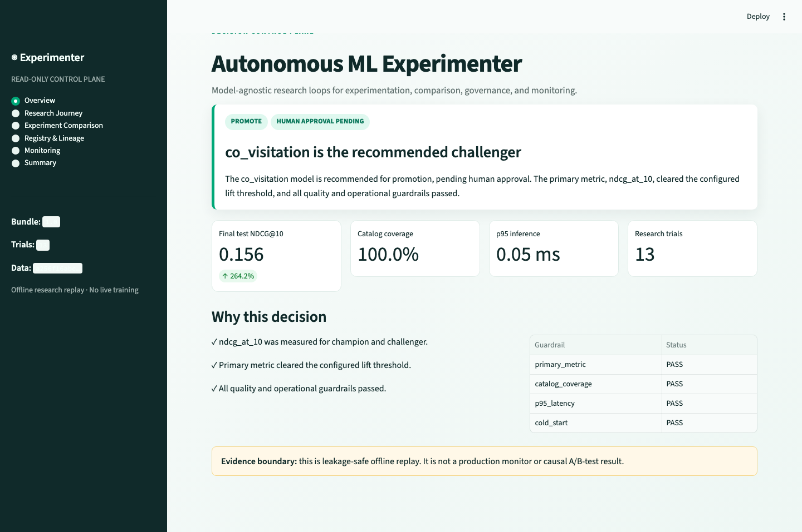
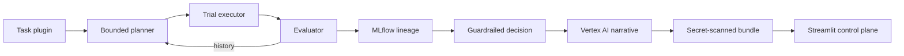
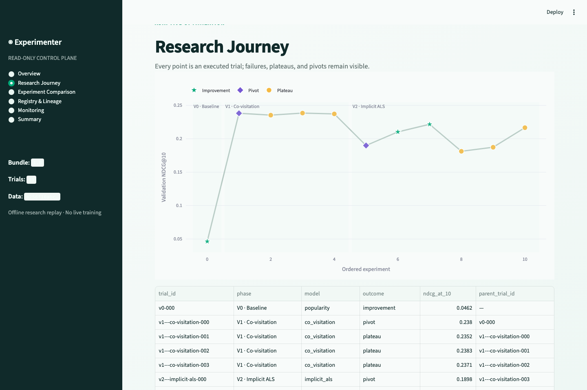
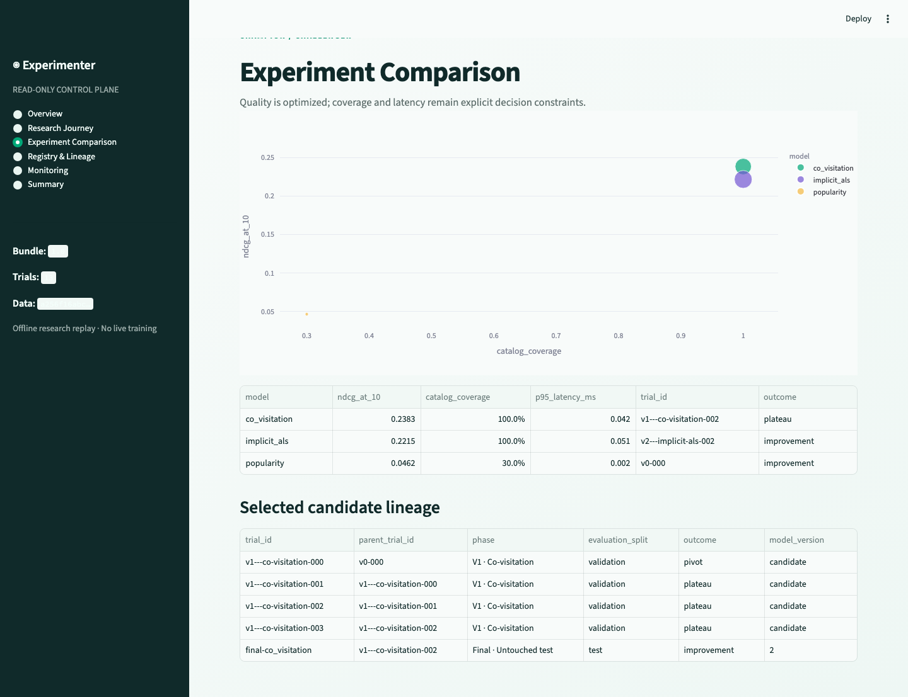
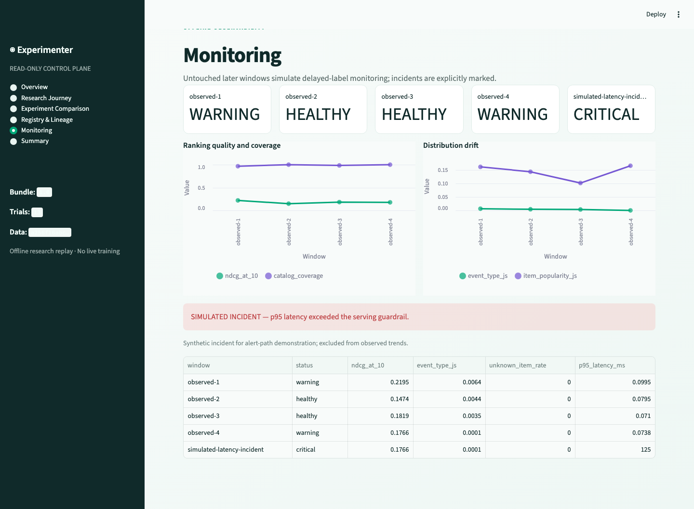

# Autonomous ML Experimenter

**Model-agnostic research loops for experimentation, comparison, governance, and monitoring.**

[](https://www.python.org/) [](https://streamlit.io/) [](#reproduce)

A bounded experimentation platform that learns from trial history, tracks hypotheses and lineage, recommends a governed champion, and exports a lightweight decision dashboard. The core is model-agnostic; recommendation models provide the demo.

> **Live app:** **[autonomous-ml-experimenter.streamlit.app](https://autonomous-ml-experimenter.streamlit.app/)** — hosted on Streamlit Community Cloud, which sleeps after 12 hours of inactivity. Click to wake it, or read the screenshots below, which are the durable fallback.



## What it demonstrates



- **Adaptive research:** seeded Optuna TPE, explicit budgets, plateau stops, family pivots, and validation-only search.
- **Traceability:** MLflow parent studies, nested trials, Git/data fingerprints, model versions, aliases, and review tags.
- **Governance:** deterministic promote/iterate/reject/inconclusive policy; the LLM cannot promote a model.
- **Observability:** untouched historical replay, quality/drift/fallback/latency indicators, plus one labeled simulated incident.
- **Safe AI:** Vertex Gemini receives redacted structured evidence and returns Pydantic-validated hypotheses/summaries; deterministic fallback is always available.

## Actual demo result

The committed bundle uses a deterministic generated commerce fixture so the hosted app is instant and reproducible. The full Retailrocket configuration uses the identical pipeline. These are offline model-development results—not causal or production claims.

| Final untouched-test result | Popularity | Co-visitation candidate |
|---|---:|---:|
| NDCG@10 | 0.0428 | **0.1559** (+264.2%) |
| Recall@10 | 0.0498 | **0.1522** |
| Catalog coverage | 35.0% | **100.0%** |
| p95 inference latency | 0.002 ms | 0.048 ms |
| Governance | Champion | **Promote recommendation; approval pending** |

The selected configuration is registered as candidate model version `2`. Search never sees the final test slice; later observations are reserved for monitoring replay.







## Reproduce

```bash
conda create -n autonomous-ml-experimenter python=3.12 -y
conda activate autonomous-ml-experimenter
pip install -e '.[local,dev]'

# No cloud credentials required
autonomous-ml-experimenter run --offline
streamlit run streamlit_app.py

# Quality gates
pytest && ruff check src app streamlit_app.py tests && mypy src app
```

For Vertex-assisted output, set `GOOGLE_APPLICATION_CREDENTIALS` to a local service-account file and run without `--offline`. Never place credentials in the repository or Streamlit artifacts.

### Retailrocket mode

Download `events.csv` from the [Retailrocket Recommender System Dataset](https://www.kaggle.com/datasets/retailrocket/ecommerce-dataset), place it at `data/raw/events.csv`, then run:

```bash
autonomous-ml-experimenter run --config configs/retailrocket.yaml
```

The dataset contains anonymized views, cart additions, and transactions and is licensed **CC BY-NC-SA 4.0**. Raw data is not redistributed. It is a commerce-personalization analogue, not evidence of cross-vertical transfer.

## Prototype → production

| Prototype | Scale path |
|---|---|
| Local runner | Airflow/Dagster/Kubeflow orchestration |
| Pandas/SciPy | Spark and governed feature pipelines |
| SQLite MLflow | Managed tracking and registry |
| Sequential Optuna | Distributed Ray Tune or managed Vizier workers |
| Batch model artifact | Online retrieval/ranking service with canary rollback |
| Historical replay | Streaming telemetry plus delayed-label quality monitoring |
| Human local approval | Audited approval, canary exposure, and rollback workflow |

## Boundaries

The dashboard is read-only and loads a compact precomputed bundle for Community Cloud. Offline replay is not live production monitoring. Statistical significance is not claimed. Popularity, co-visitation, and implicit ALS are demo adapters; another `ExperimentTask` can supply different data, models, metrics, search spaces, and guardrails.

See the [exact 100-word submission summary](SUBMISSION.md).

### Design references

[MLflow nested runs](https://mlflow.org/docs/latest/ml/traditional-ml/tutorials/hyperparameter-tuning/part1-child-runs/) · [Optuna efficient optimization](https://optuna.readthedocs.io/en/stable/tutorial/10_key_features/003_efficient_optimization_algorithms.html) · [Vertex AI Vizier](https://cloud.google.com/vertex-ai/docs/vizier/overview) · [MLAgentBench](https://arxiv.org/abs/2310.03302) · [Streamlit Community Cloud limits](https://docs.streamlit.io/deploy/streamlit-community-cloud/manage-your-app)

Content from linked references was rephrased for compliance with licensing restrictions.
